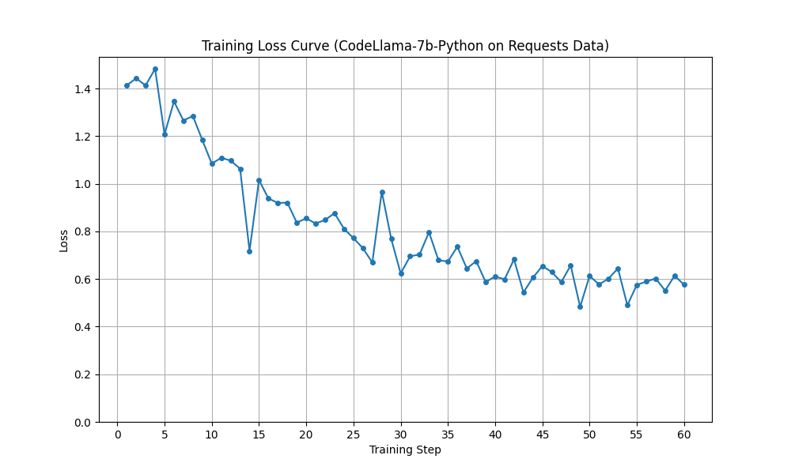

# CodeLlama Fine-tuning in Python `requests` Library

This project explores fine-tuning a CodeLlama model (specifically, `codellama/CodeLlama-7b-Python-hf`) to become better at generating code examples for the popular Python `requests` library. I use Parameter-Efficient Fine-Tuning (PEFT) with LoRA to adapt the model.

## What's Inside?

*   **Fine-tuning:** Uses LoRA (via PEFT) and 8-bit quantization for efficient training of CodeLlama-7B-Python.
*   **Dataset:** A custom dataset (`data/`) with prompt/completion pairs focused on `requests`.
*   **Training:** An interactive Jupyter Notebook (`train_model.ipynb`) walks through the fine-tuning process.
*   **Evaluation:** A script (`evaluate_model.py`) generates code from the fine-tuned 7B model and compares it against the base 7B and 13B Python models.
*   **Metrics:** Calculates standard text similarity scores (BLEU, CER, ROUGE-L, ChrF).
*   **Analysis:** Includes a look at the training loss curve and a discussion of the evaluation results.

## Project Structure

```
.
├── data/
│   ├── train.jsonl           # Training examples
│   └── test.jsonl            # Evaluation examples
├── results/
│   ├── evaluation_metrics_*.json    # Metric scores for each model tested
│   ├── evaluation_outputs_*.jsonl   # Generated code outputs for each model
│   └── learning_curve.png           # Plot of training loss
├── README.md                   # This file
├── requirements.txt
│── evaluate_model.py       # Evaluation script (generates outputs & metrics)
└── train_model.ipynb           # Jupyter Notebook for fine-tuning
```

## Getting Started

1.  **Clone the repo:**
    ```bash
    git clone <your-repo-url>
    cd <your-repo-name>
    ```
2.  **Set up a Python environment:** (Using a virtual environment is recommended)
    ```bash
    python -m venv venv
    source venv/bin/activate  # Linux/macOS
    venv\Scripts\activate    # Windows
    ```
3.  **Install dependencies:**
    ```bash
    pip install -r requirements.txt
    ```

## The Dataset (`data/`)

The `train.jsonl` (for training) and `test.jsonl` (for evaluation) files contain examples like this:

```json
{
  "prompt": "Natural language instruction, e.g., 'How to send GET request with params?'",
  "completion": "import requests\n\n# Corresponding target Python code...\nresponse = requests.get(...)\nprint(...)"
}
```

The prompt/completion pairs cover common requests use cases (GET/POST, params, headers, JSON, sessions, etc.). Initial examples were generated with AI assistance (primarily using Google Gemini) based on descriptions of desired requests functionality. Following generation, the completion code snippets were verified for basic execution using to ensure they run without immediate syntax errors or simple runtime exceptions against test endpoints.

## How to Use

### 1. Fine-tuning the 7B Model

*   Launch Jupyter Lab or Notebook and open `train_model.ipynb`.
*   Run the cells sequentially. The notebook handles loading the base model, preparing the data, setting up LoRA, and running the training loop.
*   The trained LoRA adapter layers will be saved to `./requests_codellama_final` (or the path specified in the notebook). If the final save fails, the evaluation script will attempt to load from the latest checkpoint within that directory.

### 2. Evaluating Models

*   Run the evaluation script from your terminal. Use the `--model` argument to choose which model to test.

    ```bash
    # Evaluate the fine-tuned 7B model (loads the adapter)
    python scripts/evaluate_model.py --model finetuned_7b

    # Evaluate the base 7B model
    python scripts/evaluate_model.py --model base_7b

    # Evaluate the base 13B model
    python scripts/evaluate_model.py --model base_13b
    ```
*   The script will:
    *   Load the selected model.
    *   Generate code for each prompt in `data/test.jsonl`.
    *   Save the outputs to `results/evaluation_outputs_[model_name].jsonl`.
    *   Calculate metrics and save them to `results/evaluation_metrics_[model_name].json`.
    *   Print progress and metrics to the console.

## Results and Discussion

### Training Progress (Learning Curve)

The model clearly learned during fine-tuning, as shown by the decreasing training loss:



The curve shows the model initially grappling with the data (steps ~1-13) before a period of rapid improvement (steps ~14-30) as it likely masters the basic `requests` syntax and common patterns. Later steps (~30-60) show slower, more fluctuating progress, suggesting refinement on nuances or perhaps hitting the limits of this small dataset. The relatively low final loss indicates a good fit to the training examples provided.

### Evaluation Metrics

Here's how the models compared on standard text similarity metrics (lower CER is better, higher others are better):

| Model         | BLEU    | CER     | ROUGE-L | ChrF    | Avg Gen Time (s) |
|---------------|---------|---------|---------|---------|-----------------|
| base_7b       | 0.1350  | 0.7686  | 0.2628  | 28.59   | 18.61           |
| base_13b      | 0.1419  | 0.7865  | 0.2483  | 27.72   | 22.85           |
| **finetuned_7b**| **0.3306**| 0.8107  | **0.4154**| **52.45** | 20.95           |

**Key Observations:**

*   **Fine-tuning Works:** The fine-tuned 7B model dramatically outperformed the base 7B model on metrics sensitive to word and sequence overlap (BLEU, ROUGE-L, ChrF). This strongly suggests it learned to generate code much closer to the target `requests` examples.
*   **Scaling vs. Fine-tuning:** Simply using the larger base 13B model yielded almost no improvement over the base 7B model for this specific task. The fine-tuned 7B model was significantly better than the base 13B model, emphasizing the value of task-specific adaptation.
*   **The CER Quirk:** Intriguingly, the fine-tuned model scored worse on Character Error Rate (lower is better). While improving on other metrics, it seems to produce outputs with more character-level differences from the reference. This could mean it generates functionally similar but syntactically different code (e.g., variable names, spacing).